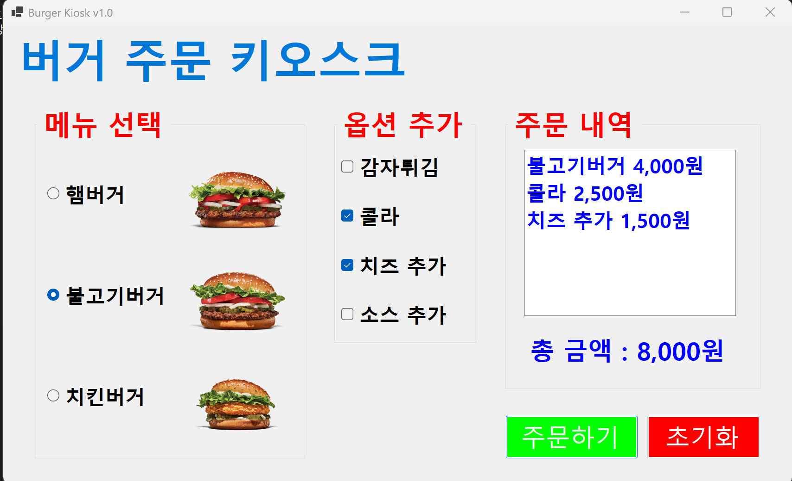
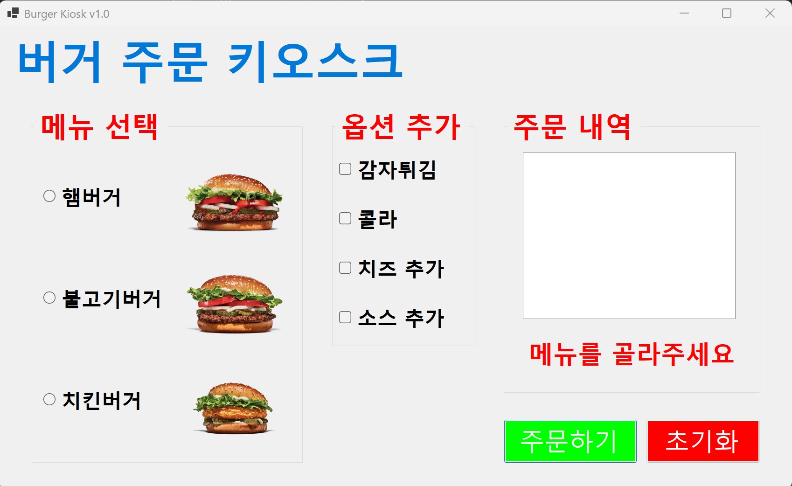
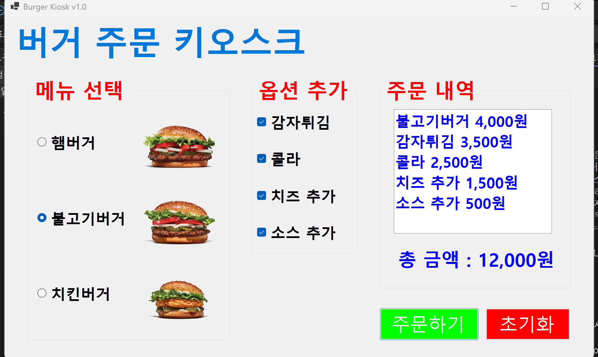
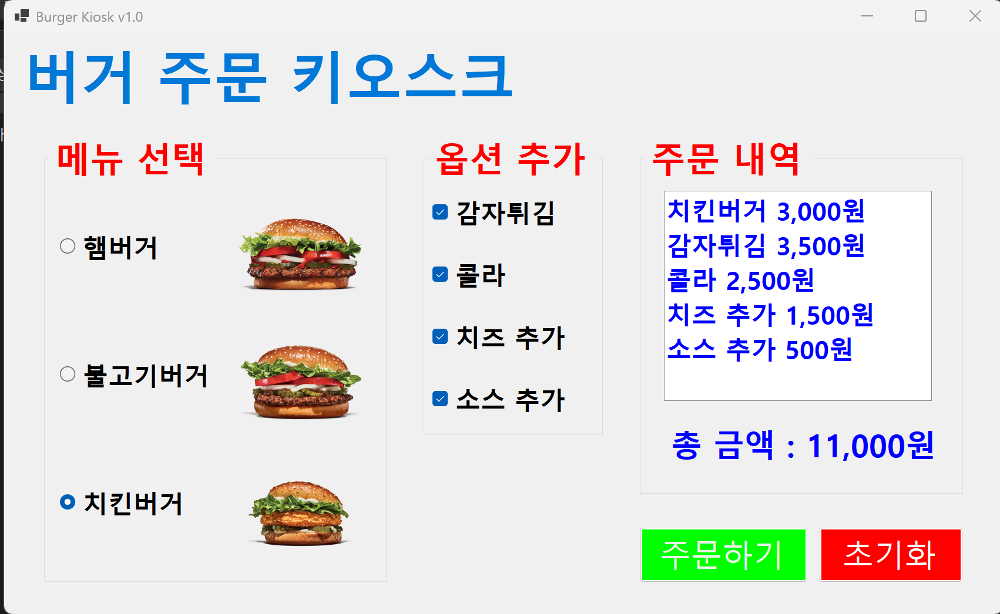

# (C# 코딩) 버거 주문 키오스크

## 개요
- C# 프로그래밍 학습
- 1줄 소개: 라디오버튼과 체크박스를 활용해 메뉴를 선택하고 금액을 계산하는 키오스크 프로그램
- 사용한 플랫폼:
    - C#, .NET Windows Forms, Visual Studio, GitHub
- 사용한 컨트롤:
    - RadioButton, CheckBox, GroupBox, Label, ListBox, Button, PictureBox
- 사용한 기술과 구현한 기능:
    - 이벤트 기반 프로그래밍(Event-driven Programming) 을 활용하여 사용자의 클릭 및 입력에 즉각 반응하는 UI 구성
    - CheckedChanged 이벤트를 공통 함수로 연결하여 항목 선택 시 실시간으로 주문 내역과 총 금액이 업데이트되는 피드백 시스템 구현
    - if - else if 문을 통한 라디오 버튼의 단일 메뉴 선택 판별 및 독립적 if 문을 활용한 체크박스 다중 옵션 중복 합산 로직 설계
    - 폼 수준의 키 입력 감지(KeyPreview) 와 포커스 제어 기술을 통해 Tab, 방향키, Space, Enter 만으로 조작 가능한 키보드 인터페이스 구현
    - GroupBox 내부 컨트롤들의 TabIndex 를 정밀하게 제어하여 그룹 간 순환 포커스 및 논리적 사용자 작업 흐름 최적화
    - Label 의 ForeColor 및 Visible 속성을 동적으로 제어하여 별도의 팝업창 없이 화면 내에서 에러 메시지를 시각화하는 예외 처리 기술 적용
    - ToString("#,##0") 포맷팅을 적용하여 천 단위 구분 기호가 포함된 가독성 높은 실시간 화폐 단위 출력 기능 구현
    - ListBox 의 Items 속성을 제어하여 선택된 메뉴의 명칭과 개별 가격을 리스트 형태로 직관적으로 나열하는 주문 확인 시스템 구축

## 실행 화면 (과제1)
- 과제1 코드의 실행 스크린샷

- 과제 내용
    - UI 구성
        - RadioButton과 CheckBox 등을 적절히 배치합니다.
        - GroupBox로 적절하게 그룹으로 묶습니다.
    - 주문하기 버튼과 초기화 버튼의 기능 구현
        - 주문 내역과 총 금액을 표시합니다.
        - 다시 주문할 수 있도록 초기화 합니다.
- 구현 내용과 기능 설명
    - GroupBox 컨트롤을 사용하여 메뉴 선택 , 추가 옵션 , 주문 내역 영역을 시각적으로 분리하고 사용자 인터페이스의 가독성을 높였다 . 
    - RadioButton 의 특징인 단일 선택 기능을 활용하여 햄버거 , 불고기버거 , 치킨버거 중 반드시 하나만 선택되도록 로직을 설계했다 . 
    - CheckBox 컨트롤을 통해 감자튀김 , 콜라 , 치즈 추가 , 소스 추가 등의 사이드 메뉴를 사용자가 원하는 만큼 중복해서 선택할 수 있도록 구현했다 . 
    - 주문하기 버튼 클릭 시 각 컨트롤의 Checked 속성을 검사하여 선택된 항목의 명칭과 가격 데이터를 추출하는 알고리즘을 적용했다 . 
    - if - else if 문을 사용하여 메인 메뉴의 중복 계산을 방지하고 , 독립적인 if 문을 나열하여 여러 개의 추가 옵션이 각각 합산되도록 처리했다 . 
    - 아무런 메뉴도 선택하지 않고 주문하기 버튼을 눌렀을 경우 , MessageBox.Show() 메서드를 호출하여 사용자에게 안내 메시지를 띄우는 예외 처리 로직을 포함했다 . 
    - totalCost 변수를 활용하여 선택된 모든 항목의 금액을 누적 합산하고 , ToString() 을 통해 문자열로 변환하여 lblTotalCost 라벨에 실시간으로 출력한다 . 
    - ListBox 컨트롤의 Items.Add() 메서드를 사용하여 선택된 메뉴와 옵션의 상세 내역을 리스트 형태로 화면에 나열하여 주문 확인 기능을 제공한다 .
    - 초기화 버튼 클릭 시 Checked 속성을 false 로 변경하고 ListBox 의 Items.Clear() 를 호출하여 모든 주문 상태를 시스템 초기 상태로 되돌리는 기능을 구현했다 . 

## 실행 화면 (과제2)
- 과제2 코드의 실행 스크린샷

- 과제 내용
    - 아무것도 선택하지 않고 주문하기 버튼을 누르면 에러 메시지 표시
- 구현 내용과 기능 설명
    - 별도의 컨트롤 추가 없이 기존의 금액 표시용 Label(lblTotalCost) 을 다목적으로 활용하여 시스템의 상태 정보를 사용자에게 전달하도록 설계했다 .
    - 사용자가 메뉴를 선택하지 않은 예외 상황 발생 시 , lblTotalCost 의 Text 를 "메뉴를 골라주세요" 로 변경하고 ForeColor 를 Red 로 설정하여 시각적 경고 효과를 극대화했다 .
    - 정상적인 주문 시에는 ForeColor 를 다시 Blue 로 변경하고 합산된 금액을 출력함으로써 , 색상 변화를 통해 주문의 성공 및 실패 여부를 직관적으로 인지할 수 있게 구현했다 .
    - 주문하기 버튼(btnOrder) 을 클릭할 때마다 이전의 에러 스타일을 초기화하는 로직을 최상단에 배치하여 UI 의 상태가 실시간으로 정확하게 반영되도록 구성했다 .
    - 조건문을 통해 메뉴 미선택 시 리스트 박스를 비우고 로직을 즉시 중단(return) 시킴으로써 , 잘못된 데이터가 누적되거나 출력되는 현상을 방지했다 .
    - 금액 출력 시 ToString("#,##0") 포맷을 적용하여 천 단위 구분 기호(,) 를 표시함으로써 실제 키오스크와 유사한 숫자 가독성을 확보했다 .
    - 초기화 버튼(btnClear) 을 통해 라디오 버튼과 체크박스의 선택 상태뿐만 아니라 , 라벨의 텍스트도 "총 금액 : 0원" 으로 되돌려 시스템의 일관성을 유지했다 .

## 실행 화면 (과제3)
- 과제3 코드의 실행 스크린샷

- 과제 내용
    - Tab을 이용해서 GroupBox 사이를 이동하기
    - 방향키를 이용해서 선택 아이템 사이를 이동하기
    - 스페이스바를 이용해서 아이템 선택하기
    - Enter키로 버튼을 누르기
        
- 구현 내용과 기능 설명
    - KeyPreview 속성을 true 로 설정하여 폼 수준에서 모든 키보드 입력을 사전에 감지하고 제어할 수 있는 기반을 마련했다.
    - Tab 키 입력 시 currentGroupIndex 를 순환시켜 메뉴, 옵션, 주문 버튼 그룹 사이를 논리적으로 이동하는 그룹 포커스 전환 로직을 구현했다.
    - 방향키(Up/Down) 를 사용하여 각 그룹 내의 개별 컨트롤 사이를 자유롭게 이동할 수 있도록 MoveAmong 공통 함수를 설계했다.
    - Space 키로 체크박스의 상태를 반전(Toggle) 시키거나 라디오 버튼을 선택할 수 있게 하여 마우스 없이도 모든 주문 행위가 가능하도록 접근성을 높였다.
    - Enter 키 입력 시 현재 포커스된 버튼의 PerformClick() 을 호출하여 주문하기 또는 초기화 기능을 즉시 실행할 수 있도록 구현했다.

## 실행 화면 (과제4)
- 과제4 코드의 실행 스크린샷

- 과제 내용
    - RadioButton과 CheckBox에서 원하는 항목을 선택하면 그 즉시 정보들이 업데이트 되도록 한다
    - 선택하는 순간 ListBox에 주문내역이 표시되도록
    - 선택하는 순간 Label에 전체 가격정보가 표시되도록
        
- 구현 내용과 기능 설명
    - CheckedChanged 이벤트 핸들러를 활용하여 사용자가 항목을 선택하거나 해제하는 즉시 시스템이 반응하는 실시간 피드백 구조를 구축했다.
    - 모든 선택 컨트롤의 이벤트를 하나의 공통 업데이트 함수(UpdateOrderInfo) 에 연결하여 코드의 중복을 최소화하고 유지보수성을 확보했다.
    - 항목을 클릭하는 즉시 ListBox 의 주문 내역과 Label 의 총 금액 정보가 동기화되어 사용자에게 끊김 없는 인터페이스 경험을 제공한다.
    - 사용자 편의를 위해 불필요한 메시지 팝업창을 제거하고, 화면 내의 라벨 색상 변화(Blue/Red) 만으로 상태 정보를 실시간 전달하도록 최적화했다.
    - 금액 표시 시 숫자 포맷팅(ToString("#,##0")) 을 실시간 로직에 포함하여 데이터 변화 시에도 가독성 높은 화폐 단위 출력을 유지했다.